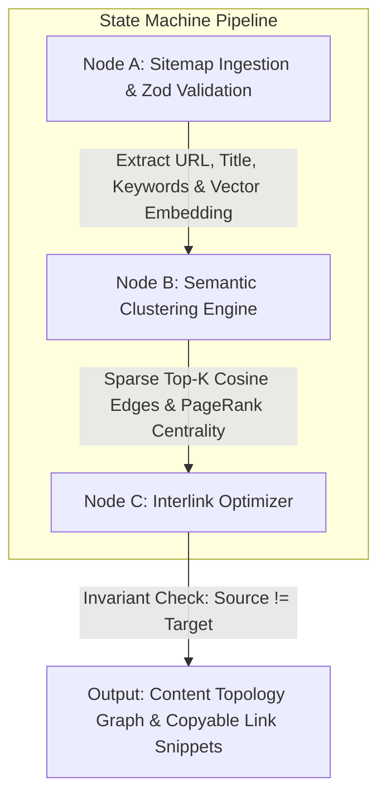

# 🤖 `seo-content-graph-agent`

> **Autonomous State-Machine Agent for Semantic Content Clustering & PageRank Internal Link Graph Optimization**

[](https://github.com/bscodes/seo-content-graph-agent/actions)


---

## 🎯 Executive Overview & Business Value

`seo-content-graph-agent` is an engineering-grade AI agent designed for **Programmatic SEO** and **Search Engine Architecture**. 

Modern content teams produce dozens of articles weekly, but often fail to maximize organic search authority due to fragmented, manual internal linking. This agent ingests site sitemaps, computes vector semantic similarity matrices across all pages, clusters articles into topic hubs, and computes optimal internal link graphs that direct internal PageRank to strategic pillar pages.

---

## 📐 Graph State Machine Architecture

The agent executes a deterministic 3-node state machine workflow:



### 💡 Strategic Business Value & Impact:
1. **Automated Internal PageRank Efficiency**: Directs search crawler equity from low-traffic orphan pages to revenue-driving pillar content automatically, measuring exact PR flow improvements.
2. **Contextual Semantic Authority Clustering**: Eliminates keyword cannibalization by grouping articles into focused topical silos that rank higher on Google's Knowledge Graph.
3. **High-Converting Keyword Anchors**: Replaces generic "click here" links with target keyword anchors that boost SERP keyword relevancy.
4. **Zero-Touch Programmatic Scale**: Reduces manual SEO audits from 20+ hours per month to a single automated pipeline command. Built for programmatic-scale processing via $O(N \\times K)$ sparse graph logic, eliminating quadratic memory exhaustion on massive sitemaps.

---

## 🚀 Quickstart & Installation

### 1. Local Development UI

Clone repository and launch the interactive visualizer:

```bash
git clone https://github.com/bscodes/seo-content-graph-agent.git
cd seo-content-graph-agent
npm install
npm run dev
```

Open [http://localhost:3000](http://localhost:3000) to interact with the topology node graph visualizer.

---

### 2. CLI Usage (`seo-graph analyze`)

Analyze any custom sitemap JSON or the built-in SaaS dataset directly from your terminal:

```bash
# Run CLI on default sample dataset
npm run cli -- analyze

# Run on custom sitemap with 0.75 similarity threshold
npm run cli -- analyze --sitemap=sitemap.json --threshold=0.75 --output=link-recommendations.json
```

---

## 🧪 Verification & Unit Testing

Run the automated test suite powered by Vitest:

```bash
# Run unit test assertions
npm test

# Run TypeScript strict typecheck
npm run typecheck
```

---

## 🐳 Docker Deployment

Run the agent container via Docker Compose:

```bash
docker compose up --build
```

---

## 📄 Data Contract Specs (`src/types.ts`)

```typescript
export interface PageNode {
  id: string;
  url: string;
  title: string;
  targetKeyword: string;
  category?: string;
  contentSnippet?: string;
  embedding?: number[];
  pageRankScore?: number;
  clusterId?: string;
}

export interface InternalLinkRecommendation {
  id: string;
  sourceUrl: string;
  sourceTitle: string;
  targetUrl: string;
  targetTitle: string;
  suggestedAnchorText: string;
  relevanceScore: number;
  reasoning: string;
  clusterId: string;
}
```

---

## 📜 License

Distributed under the MIT License.
